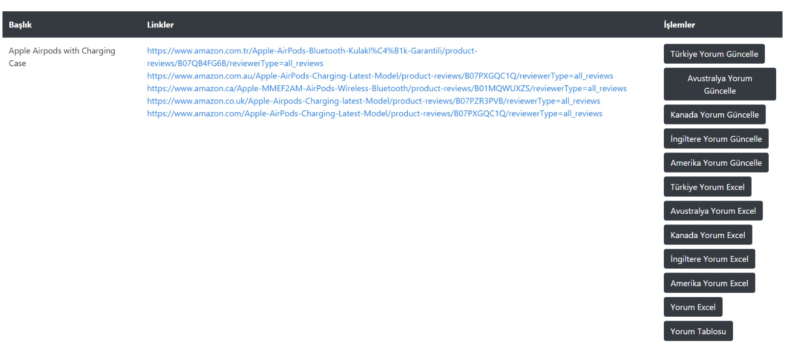

## Review Collector

Review collector for shopping websites(Amazon).

## How to use

- To run the app you need php server, mysql database, nodejs, nodejs package manager(yarn or npm), composer(Laragon). You can check other server requirements from this <a href="https://laravel.com/docs/8.x#server-requirements">link.</a>
- Run composer update
- Run npm install or yarn
- Run npm run dev or yarn run dev
- Edit .env file (For mysql database credentials)
- Run php artisan migrate --seed
